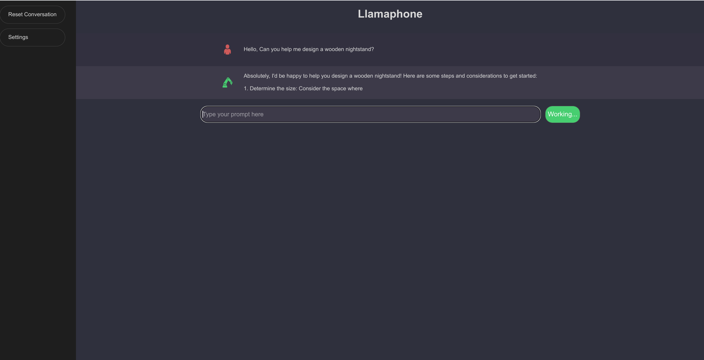

# Llamaphone

A single-file static frontend to go with your [single-file LLM](https://github.com/Mozilla-Ocho/llamafile)

## Details

With all the hype around the recent release of Llamafile, I thought it'd be nice to have a dedicated frontend.
Llamaphone uses the OpenAI API compatibility recently introduced to Llamafile to interact with the model. Your chat and preferences are stored in browser storage, so you can close the window and come back to your conversation later.

## Installation

1. Clone the repository
2. Open index.html in your favorite web browser and make sure the API Endpoint is set correctly.

## Screenshot


## Questions
```
Q. Does it work with the actual OpenAI API?
A. No. Llamaphone doesn't support API keys. If you want to add this functionality, please be my guest.
```

```
Q. I set it up, but it doesn't work!
A. That could be any of several issues. For instance, check the API endpoint in settings to make sure it's pointed at the right server address and port. If that's not it, check your browser console for errors.
```

```
Q. I have [x really cool feature.] May I implement it and make a PR?
A. Absolutely.
```
